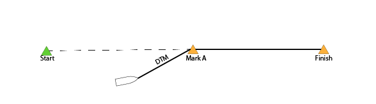

```{r setup, include=FALSE}
knitr::opts_chunk$set(echo = FALSE, warning=FALSE, message = FALSE)

rm(list=ls())

library(ggplot2)
library(ggrepel)
library(tidyverse)
library(lubridate)

#load data
load("./data/marks.Rdata")           #location of the marks
load("./data/zube_performance.rda")  #zube's performance variables
load("./data/results.Rdata")         #class data from BYCMACK webpage
load("./data/positions_wcorr.Rdata") #yellowbrick positions with corrected time
load("./data/zube_yb_withdiff.rda")  #zube yellowbrick data with difference from class0 boats
load("./data/expeditiondata_perf.rda")

#Data Cleanup and Joining

#add class data to YellowBrick position data
results <- results %>% select(-elapsed_time, -Corrected)
  
#extract our class
classo <- posn %>% filter(class == "Class O Class")


```

##Objectives
Determine if gain or loss versus other boats is due to poor boat trim and course or due to bad luck. 

***

###Data Sources
* YellowBrick: Position of Zubenelgenubi versus other boats
* Boat Instrumentation: Wind, Boat Speed, and Position

###Measured Values
* TWA: True Wind Angle [Deg]
* TWS: True Wind Speed [kts]
* COG: Course Over Ground [Deg]
* SOG: Speed Over Ground [kts]
* Position: Lat/Lon

###Derived Values
* Optimal Boat Speed [kts] -- From boat polars
* Polar Percentage [%]
* Optimal Velocity to the Mark
* VMC Percentage [%]
* DMG: Distance Made Good to the Mark (Total Track Distance - Distance Remaining)


###Data Collected
The boat instrument data was collected through Expedition [link] running on a tablet connected to the boat through wifi. 

However, the tablet could not run the entire race due to battery life. So we could not collect boat instrument data throughout the entire race. 

```{r fig.height=10, fig.width=8, warning=FALSE}
#get states shape files
mi <- map_data("state") %>% filter(region=="michigan")


cols <- c("Class O"="dark grey", "Expedition Data"="blue", "YellowBrick Data"="red")

#plot the positions
mapplot <- ggplot()+
            geom_polygon(data=mi, aes(long, lat, group=group)) + 
            coord_map("polyconic", xlim=c(-85, -82), ylim=c(42.8, 46))

mapplot + geom_path(data=classo, aes(x=lon, y=lat, group=boat, color="Class O")) + 
  geom_point(data=zube, aes(x=lon.exp, y=lat.exp, color="Expedition Data"))+
  geom_path(data=zube_yb, aes(x=lon, y=lat, color="YellowBrick Data", group="boat"))+
  scale_color_manual(name="Data Source", values=cols)+
  scale_x_continuous(name="Longitude")+
  scale_y_continuous(name="Latitude")
  
```


##Performance Versus other boats

```{r fig.height=10, fig.width=8}
colors <- c(RColorBrewer::brewer.pal(10, name = "Paired"), "black")

mapplot + geom_path(data=classo, aes(x=lon, y=lat, color=boat)) + 
  scale_color_manual(values = colors)


```


### Comparison of Distance Made Good to the Mark
This shows the total distance made good [DMG] to the mark. 

Distance Made Good is the Total Race Distance minus total distance to finish. Distance to finish includes the distance to the current mark plus the distance between all remaning marks. 



```{r fig.height=6, fig.width=8}

classo <- classo[classo$dmg > 0, ]


#time passing each mark
markpassing <- classo %>% group_by(boat, mark) %>% summarise(timepassing = min(time), dmg_pass = min(dmg))

#
startTime <- as.POSIXct("2018-7-14 11:00:00")


classo$day <- format(classo$time, "%F")

ggplot()+geom_path(data=classo, aes(x=time, y=dmg, color=boat))+
  geom_hline(data=marks, aes(yintercept=dmg))+
  geom_text(data=marks, aes(x=startTime, y=dmg, label=mark), nudge_y = 2, size=3)+
  scale_color_manual(values=colors)+
  ggtitle("DMG Entire Race - All of Class O")

```

On Corrected Time
```{r fig.height=6, fig.width=8}
ggplot()+geom_path(data=classo, aes(x=corr_time, y=dmg, color=boat))+
  geom_hline(data=marks, aes(yintercept=dmg))+
  geom_text(data=marks, aes(x=startTime, y=dmg, label=mark), nudge_y = 2, size=3)+
  scale_color_manual(values=colors)+
  ggtitle("DMG Entire Race - All of Class O")

```

Performance to our polars over the race
Because it is difficult to view, we'll split into different legs

```{r fig.height=8, fig.width=8}

legs <- data.frame(leg = c("ST-HB", "ST-HB", "HB-TBLT", "TBLT-PI", "TBLT-PI", "TBLT-PI", "PI-FIN", "PI-FIN"), 
                   mark = unique(zube$mark))

legs$leg <- ordered(legs$leg, levels = c("ST-HB", "HB-TBLT", "TBLT-PI", "PI-FIN"))

zube <- left_join(zube, legs)

classo <- left_join(classo, legs)

leg1 <- classo[classo$leg == "ST-HB", ]

ggplot()+geom_path(data=leg1, aes(x=corr_time, y=dmg, color=boat))+
  geom_hline(data=marks, aes(yintercept=dmg))+
  geom_text(data=marks, aes(x=startTime, y=dmg, label=mark), nudge_y = 2, size=3)+
  scale_color_manual(values=colors)+
  scale_y_continuous(limits=c(0, 50))+
  scale_x_datetime(limits=c(as.POSIXct("2018-07-14 14:00:00"), as.POSIXct("2018-07-15 09:00:00")))+
  ggtitle("Start to Harbor Beach")


```


```{r fig.height=6, fig.width=8}

zube$pol_perc[is.infinite(zube$pol_perc)] <- NA

ggplot()+geom_path(data=classo, aes(x=corr_time, y=dmg, group=boat), color="dark gray")+
  geom_point(data=zube, aes(x=corr_time, y=dmg, color=pol_perc))+
  geom_hline(data=marks, aes(yintercept=dmg))+
  geom_text(data=marks, aes(x=startTime, y=dmg, label=mark), nudge_y = 2, size=3)+
  scale_color_gradient(low = "red", high="blue", limits=c(0, 200))+
  ggtitle("DMG Entire Race - All of Class O")


```


We can see that coming into Presque Isle we actually were in 5th place corrected ahead of Courage, Defiant, and La Faucon. 

```{r fig.height=6, fig.width=8}

ggplot()+geom_path(data=classo, aes(x=corr_time, y=dmg, color=boat))+
  scale_color_manual(values=colors)+
  geom_hline(data=marks, aes(yintercept=dmg))+
  geom_text(data=marks, aes(x=as.POSIXct("2018-07-15 21:00:00 EDT"), y=dmg, label=mark), nudge_y = 2, size=3)+
  ggtitle("DMG False Presque Isle to Finish")+
  scale_y_continuous(limits=c(138, 205))+
  scale_x_datetime(limits=c(as.POSIXct("2018-07-15 21:00:00 EDT"), as.POSIXct("2018-07-16 22:00:00 EDT")))
```


##Against Albacore
We'll use Albacore as our reference boat to compare our gain/loss during the race. 


