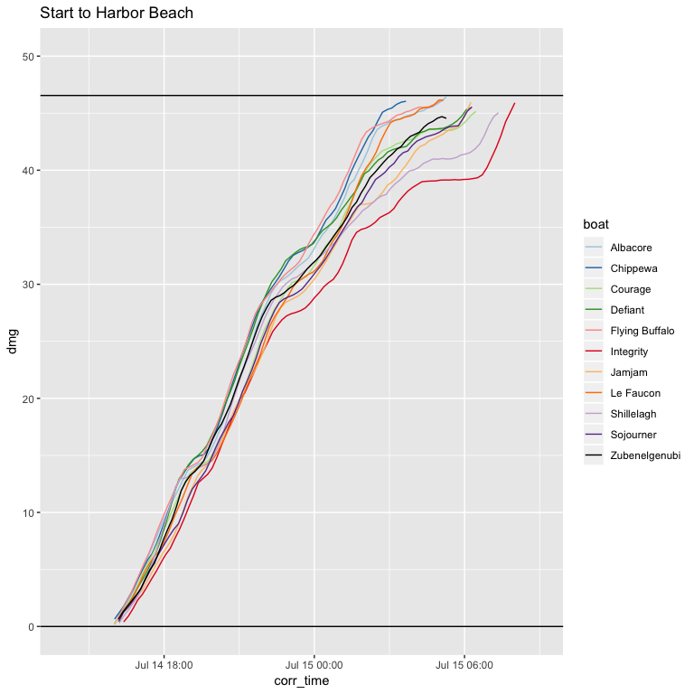

PERFORMANCE ANALYSIS
================

Objectives
----------

Determine if gain or loss versus other boats is due to poor boat trim and course or due to bad luck.

------------------------------------------------------------------------

### Data Sources

-   YellowBrick: Position of Zubenelgenubi versus other boats
-   Boat Instrumentation: Wind, Boat Speed, and Position

### Measured Values

-   TWA: True Wind Angle \[Deg\]
-   TWS: True Wind Speed \[kts\]
-   COG: Course Over Ground \[Deg\]
-   SOG: Speed Over Ground \[kts\]
-   Position: Lat/Lon

### Derived Values

-   Optimal Boat Speed \[kts\] -- From boat polars
-   Polar Percentage \[%\]
-   Optimal Velocity to the Mark
-   VMC Percentage \[%\]
-   DMG: Distance Made Good to the Mark (Total Track Distance - Distance Remaining)

### Data Collected

The boat instrument data was collected through Expedition \[link\] running on a tablet connected to the boat through wifi.

However, the tablet could not run the entire race due to battery life. So we could not collect boat instrument data throughout the entire race.

Performance Versus other boats
------------------------------

### Comparison of Distance Made Good to the Mark

This shows the total distance made good \[DMG\] to the mark.

Distance Made Good is the Total Race Distance minus total distance to finish. Distance to finish includes the distance to the current mark plus the distance between all remaning marks.

On Corrected Time 

We can see that coming into Presque Isle we actually were in 5th place corrected ahead of Courage, Defiant, and La Faucon.

Against Albacore
----------------

We'll use Albacore as our reference boat to compare our gain/loss during the race.
